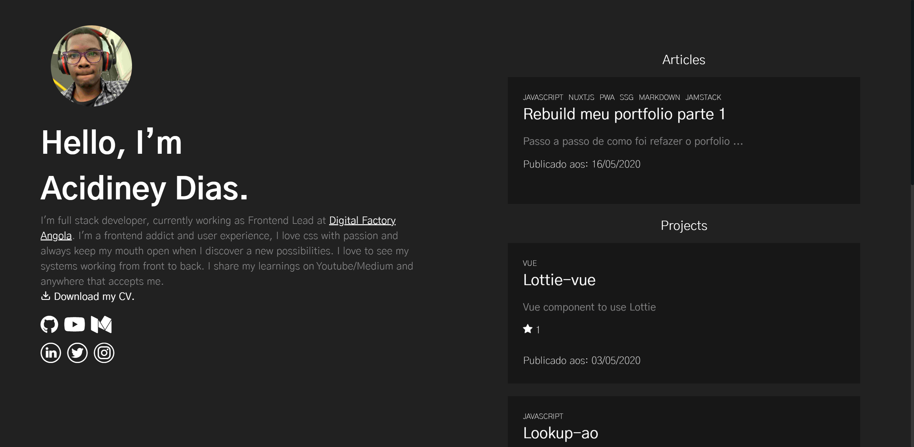
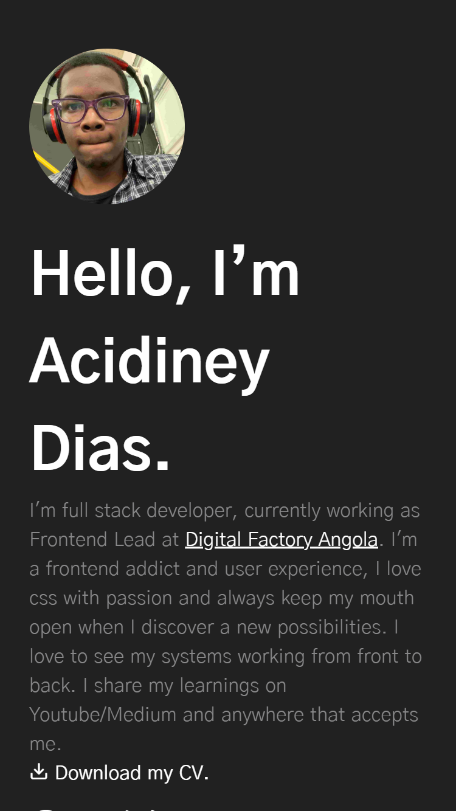

[](https://app.netlify.com/sites/acidineydias/deploys)

<h1 align="center">
    My Personal Website
</h1>
<p align="center">
  

  
  
  <a href="https://github.com/acidiney/acidiney.github.io/commits/master">
    
  </a>

  <a href="https://github.com/acidiney/acidiney.github.io/issues">
    
  </a>

  
</p>

<p align="center">
  <a href="#rocket-techs">Techs</a>&nbsp;&nbsp;&nbsp;|&nbsp;&nbsp;&nbsp;
  <a href="#-project">Project</a>&nbsp;&nbsp;&nbsp;|&nbsp;&nbsp;&nbsp;
  <a href="#-game">Layout</a>&nbsp;&nbsp;&nbsp;|&nbsp;&nbsp;&nbsp;
  <a href="#-how-to-build-setup">How to Build Setup</a>&nbsp;&nbsp;&nbsp;|&nbsp;&nbsp;&nbsp;
  <a href="#-how-to-contribute">How to Contribute</a>&nbsp;&nbsp;&nbsp;|&nbsp;&nbsp;&nbsp;
  <a href="#memo-license">License</a>&nbsp;&nbsp;&nbsp;|&nbsp;&nbsp;&nbsp;
  <a href="#-author">Author</a>
</p>

## :rocket: Techs

This project was developed with the following technologies:

- [VueJs](https://vuejs.org/)
- [Javascript](https://www.w3schools.com/js/)
- [NuxtJs](https://nuxtjs.org/)
- [Jamstack](https://jamstack.org/)
- [CSS](https://www.w3schools.com/css/)

## 💻 Project

This is my personal website, made with Nuxt JS.

## Layout

###  Desktop Layout



###  Mobile Layout



#### Link to preview project

[Preview](https://www.acidineydias.me/)


## How to  Build Setup

```bash
# install dependencies
$ yarn install

# serve with hot reload at localhost:3000
$ yarn dev

# build for production and launch server
$ yarn build
$ yarn start

# generate static project
$ yarn generate
```

## 🤔 How to Contribute

- Fork this repository;
- Create a branch with your feature: `git checkout -b my-feature`;
- Commit your changes: `git commit -m 'feat: my new feature'`;
- Push to your branch: `git push origin my-feature`.

After the merge of your pull request is done, you can delete your branch.

## :memo: License

This project is under the MIT license. See the archive [LICENSE](LICENSE.md) for more details.

## Author

[Acidiney Dias](https://github.com/acidiney/)
